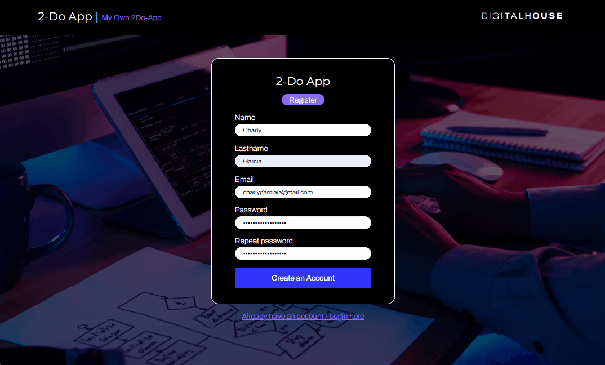
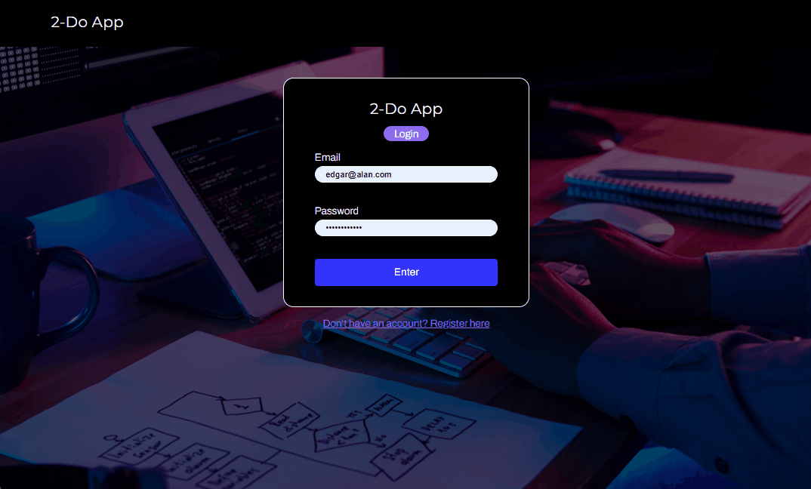

# ✅ ToDoApp - Full Stack Version

This project is a full-stack version of the original [ToDoApp frontend project](https://github.com/MatiasCastellon1214/toDoAap.git), originally developed as a final assignment for the **Frontend II** course in the Certified Tech Developer program.

In this enhanced version, the frontend was improved and a full backend was implemented to provide a persistent, functional task management system.

---

## 🚀 Technologies Used

### 🖥️ Frontend
- HTML
- CSS
- Vanilla JavaScript

### 🛠️ Backend
- Java 17
- Spring Boot
- Spring Security (JWT Authentication)
- Spring Data JPA
- MySQL

### 🐳 Containerization
- Docker
- Docker Compose

---

## ⚙️ Features

- User registration and login with JWT-based authentication
- Create, update, delete, and list tasks
- Tasks are user-specific (each user can only see their own)
- Responsive UI
- Environment-based configuration using `.env`

---

## 🛠️ Setup Instructions (First-Time Setup)

### 1. Clone the repository

```bash
git clone https://github.com/MatiasCastellon1214/2doAap.git
cd 2doAap

```
---
### 2. Backend Configuration

- Create a .env file in the root directory and fill it based on .env.example.

```ini
APP_NAME=toDoApp
SERVER_PORT=8081

DB_URL=jdbc:mysql://localhost:3306/todo_app
DB_USERNAME=root
DB_PASSWORD=admin

JWT_SECRET=your_secret_key
JWT_EXPIRATION_MS=86400000

```
---
### 3. Create the MySQL database

- Start your MySQL server and create a database called todo_app.

```sql
CREATE DATABASE todo_app;
```
---

### 4. (Optional) Compile the backend manually (first-time only)

- If this is your first time running the app, compile the backend with Maven to generate the JAR file:

```bash
mvn clean package -DskipTests
```

---

## ▶️ How to Run the Application

### Option 1 - Using the script `start-app.sh` (Recommended)

This script builds and starts the backend containers and serves the frontend automatically:

```bash
chmod +x start-app.sh
./start-app.sh
```

What it does:

- Runs docker-compose inside the backend/ directory

- Waits a few seconds for the backend to initialize

- Starts the frontend server using live-server (or falls back to Python's HTTP server)

---

## Option 2 - 🛠️ Option 2 - Manual Execution

### Backend

```bash
cd backend
docker-compose up --build
```

### Frontend

Using `live-server` (recommended):

```bash
cd frontend
live-server --port=5501
```
Or using Python (requires Python 3):

```bash
cd frontend
python3 -m http.server 5501
```
---

## 🌐 Application Access

- **Backend:** [http://localhost:8081](http://localhost:8081)
- **Frontend:** [http://localhost:5501](http://localhost:5501)
---

## 🧪 Accessing MySQL Data (Optional)

To inspect the database manually:

```bash
docker exec -it mysql_todo mysql -u todo_user -p
```
Then:

```sql
USE todo_app;
SELECT * FROM users;
SELECT * FROM tasks;
```
---

## 🎬 Demo

### 👤 User Registration



### 🔐 User Login



---
📌 Notes

- This repository merges both frontend and backend into one full-stack solution.

- Authentication is handled with JWT, and each user's tasks are securely managed.

- Ideal for educational purposes or as a starting point for more complex full-stack apps.

- Developed as part of the Certified Tech Developer program (Digital House).
---

## 🤝 Author

Developed by **Matías Castellón**
  
